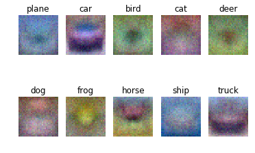
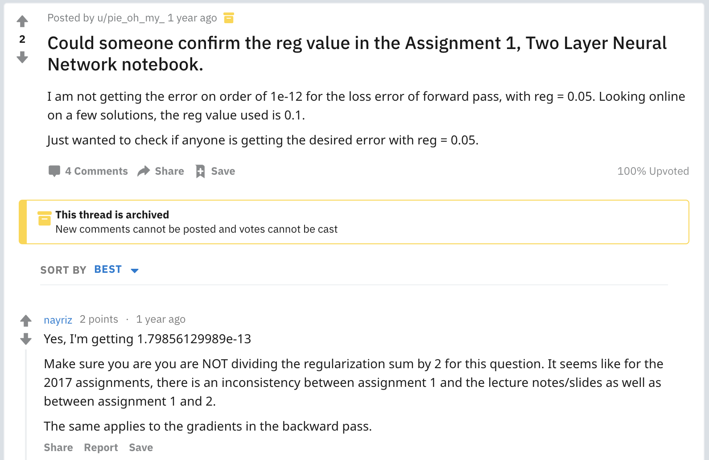

# 作业笔记

<center>邱建鑫</center>

## Assignment 1

### 线性模型，利用 Softmax 学习权重

先去执行 `cs231n/datasets/get_datasets.sh` 下载 CIFAR-10 数据集。

然后，首先把 `cs231n/classifiers/linear_classifier.py` 里线性分类器的脚手架给实现了：

```python
# 随机选取 minibatch
indices = np.random.choice(y.shape[0], batch_size)
X_batch = X[indices]
y_batch = y[indices]
# 梯度更新
self.W -= learning_rate * grad
# 预测
y_pred = np.argmax(np.dot(X, self.W), axis=1)
```

之后去到 `cs231n/classifiers/softmax.py`。

这里要求实现两种 Softmax Loss 及 梯度的计算函数。一种允许使用循环；另一种只能使用向量操作。

第一个允许循环，就按照 Softmax 的定义直接走就好了。

```python
batch_size = X.shape[0] # batch size
S = np.dot(X, W) # softmax values of the batch
for i in range(batch_size):
  # First compute softmax and its loss
  s = S[i, :]
  s -= np.max(s) # for numeric stability
  d = np.sum(np.exp(s)) # the denominator in softmax expression
  s = np.exp(s) / d # compute softmax
  loss += -np.log(s[y[i]]) # compute loss
  # Then compute dW
  # Difference is the "-1"
  for j in range(s.shape[0]):
    if j == y[i]:
      dW[:, j] += X[i] * (s[j] - 1)
    else:
      dW[:, j] += X[i] * s[j]
# divided by batch size, plus L2 regularization
loss = loss / batch_size + 0.5 * reg * np.sum(W*W) # 0.5: L2 范数求导后产生系数 2, 为使得梯度表达式简洁在这里配 0.5 的系数
dW = dW / batch_size + reg * W
```

一点 Note：

1. 这里的正则惩罚项，分为 L1、L2 等（对应 矩阵的 L1 范数、L2 范数……）L1 可以使得学习出来的权重倾向于只有少数元素为非 0，为稀疏矩阵；L2 则倾向于让权重矩阵的各个元素很小，抗扰动能力强，防止过拟合。
2. 计算 Softmax 的时候，对每个数据点都减去了分量的最大值。由于指数函数增长很快，一些过大的分量就容易导致很大的数相除，造成浮点数计算的不精确、不稳定。为了计算的稳定性，就让数据点更小一点吧（

第二个要求不允许出现循环：

```python
batch_size = X.shape[0]
S = np.dot(X, W)
S -= np.reshape(np.max(S, axis=1), (batch_size, 1)) # broadcasting
S = np.exp(S) / np.sum(np.exp(S), axis=1, keepdims=True)
ones = np.zeros_like(S)
ones[np.arange(batch_size), y] = 1.0
loss = -np.sum(np.multiply(ones, np.log(S))) / batch_size + 0.5 * reg * np.sum(W*W)
dW = np.dot(X.T, S - ones) / batch_size + reg * W
```

这里的 ones 矩阵，只有数据对应的正确标签的分量为 1，其他为 0；矩阵对应了计算 Softmax 中唯一的正确点，以及计算梯度时对正确点的分类讨论情况。

Notebook 里的两个问题也贴在这里吧：

#### 问题 1: Why do we expect our loss to be close to -log(0.1)? Explain briefly.
**答：**Softmax Loss 的公式为 $L = - \sum y_i log(s_i)$，其中 $y_i$ 只有对应真实标签时才为 1，其余为 0。由于权重矩阵 $W$ 是随机生成的，所以对每一个输入 $X$，经过 Softmax 函数归一化的预测值的每一个分量应该是几乎相等的。而 Softmax 函数值所有分量之和为 1，即真实标签的分量应该接近于0.1，所以 loss 接近于 $-log(0.1)$。

#### 问题 2: It's possible to add a new datapoint to a training set that would leave the SVM loss unchanged, but this is not the case with the Softmax classifier loss.

**答：**正确，因为 SVM 只要数据点距离超平面的间距超过 1 后，就没有 loss；而 Softmax 无论数据点怎么样都有 loss。

通过最后的可视化可以发现，这个线性分类模型权重的学习结果就是该类所有图像的平均值……因此难怪准确率一直在 0.35 左右徘徊



<center>↑注意那匹双头马</center>

所以线性模型的局限性还是很大的。要想提高准确度，必须采用非线性的分类模型。

### 两层神经网络

这个 Notebook 要求实现一个简单的两层神经网络。

这个网络的结构如下：
$$
Input \rightarrow FC_1 \rightarrow ReLU \rightarrow FC_2 \rightarrow Softmax
$$
第一个任务是简单的前向传播。直接计算即可：

```python
fc1 = np.dot(X, W1) + b1 # fully-connected layer 1
r1 = np.maximum(fc1, 0) # np.maximum(): ReLU layer
fc2 = np.dot(r1, W2) + b2 # fully-connected layer 2
scores = fc2
```

获得 3.6802720496109664e-08 的误差。

到了第二个任务计算 Softmax Loss 的部分，我却无论如何都不能让 loss 与标准答案的差值小于 1e12。

于是我翻遍了谷歌，终于在 Reddit 上找到了答案：



原来这里的正则惩罚不用乘以 0.5……

（默默吐槽一下前后不一致的问题）

代码如下，基本与 Softmax 一节一致：

```python
softmax = np.exp(scores) / np.sum(np.exp(scores), axis=1, keepdims=True)
ones = np.zeros_like(softmax)
ones[np.arange(N), y] = 1.0
loss = -np.sum(np.multiply(ones, np.log(softmax))) / N
loss += reg * (np.sum(W1 * W1) + np.sum(W2 * W2))
```

第三个任务，求反向传播的梯度。

```python
d2 = softmax - ones
grads['W2']= np.dot(r1.T, d2) / N + 2 * reg * W2 # 这里相应的正则项要乘以 2
grads['b2'] = np.ones(N).dot(d2) / N 
ones_relu = np.zeros_like(r1)
ones_relu[r1 > 0] = 1.0
d1 = d2.dot(W2.T) * ones_relu
grads['W1'] = X.T.dot(d1) / N + 2 * reg * W1 # 这里相应的正则项要乘以 2
grads['b1'] = np.ones(N).dot(d1) / N
```

后面几个任务与之前的一致，不再赘述。

在 `toy_model` 上进行测试，可以看到 loss 达到 0.017，满足了 < 0.02 的要求。

然而，当转而在 CIFAR-10 上进行训练时，准确度却只能达到 0.287，还不如之前的线性模型。

检查训练过程中的 Loss 曲线和准确度曲线，可以发现，可能是学习速率过低或模型过小导致的。

调参……增加了隐藏层的神经元数量和学习速率……

一个较好的结果如下：

```
Accuracy: 0.483 hidden_size: 100 batch_size: 100 learning_rate: 0.001 reg: 0.1
New best accuracy is 0.483
```

并在测试集上获得 0.489 的 Accuracy。

#### 课后问题：Now that you have trained a Neural Network classifier, you may find that your testing accuracy is much lower than the training accuracy. In what ways can we decrease this gap? Select all that apply.

**答：**增大数据集和增大正则惩罚强度都可以提高模型泛化能力。而增加隐藏层节点会使模型更加过拟合，减少泛化能力。

## Assignment 2

这个作业要求完成全连接神经网络的反向传播代码。

Assignment 2 与 1 的区别在于，1 中多层神经网络均在一个函数中实现计算结果及梯度。没有进行模块化，这样在搭建更大的神经网络时就会力不从心。

Notebook 初始化时要求手动执行编译一个 Cython 模块并重启 Kernel，照做就好。

首先是全连接层。

前向传播。这里要求把每一个样本化成一维向量的形式，用 `reshape` 函数即可轻松完成。

```python
out = np.dot(x.reshape(x.shape[0], -1), w) + b
```

全连接层的反向传播，前向传播的公式对 x, w, b 分别求偏导，并由链式法则，乘上上一层的梯度即可：

```python
dx = np.dot(dout, w.T).reshape(x.shape)
dw = np.dot(x.reshape(x.shape[0], -1).T, dout)
db = np.sum(dout, axis=0)
```

ReLU 前向传播：

```python
out = np.maximum(x, 0)
```

ReLU 反向传播。本层梯度激活时为 1，不激活时为 0，根据链式法则，把上一层传来的 dout 中对应 x 中小于等于 0 的位置置为 0 即可：

```python
dx = dout.copy()
dx[x <= 0] = 0
```

#### 问题：An issue commonly seen with activation functions is getting zero (or close to zero) gradient flow during backpropagation. Which of the following activation functions have this problem? 

- Sigmoid
- ReLU
- Leaky ReLU

**答**：Sigmoid 会有梯度消失的问题。因为对 Sigmoid 函数求导可以发现，导数的最大值为 0.25。这样不论如何，梯度反向传播时在经过 Sigmoid 层后至少会减少到原来的 1/4。多层 Sigmoid 函数串联起来，梯度就会迅速消失，接近于 0。而 Relu、Leaky ReLU 在激活区域的梯度均为 1，不会有梯度消失的情况。

## Debug 过程中的感想

1. 善于利用 NumPy 的广播（Broadcasting）机制，可以让代码简洁很多……
2. 教材出错害死人……

## 对神经网络的一点感受

神经网络本质上就是函数的串联。输入数据输入到第一层函数，像在「水管」里一样被各层函数计算，计算结果作为下一层的输入；这样一级一级传播下去，最后在最后一层得到输出结果。每一层的各个函数都十分的简单，甚至是线性的；大量的函数组合在一起，就可以从宏观上拟合一个复杂的非线性函数。这个复杂的函数接受我们的数据，输出我们的预测结果。

而神经网络的训练，就是要找到一组参数，使得输入可以对应我们想要的输出。由此，在最后一层之后再加一个损失层 （Loss），利用概率推导，目标是让 Loss 值尽可能的小（大也不一定）。这可以通过梯度下降的方式。在最后一层求导，再由链式法则传递到前一层函数……最后各层都会有一个梯度，用梯度更新各个层的参数，以上就是所谓反向传播。神经网络（简单的）的训练过程，就是先正向计算出结果，计算 Loss，再反向求导传播梯度，更新各个函数的权重/参数……这样反复循环，直到 Loss 达到一个可接受的值。

由此衍生出一些优化这些过程的方法。比如 SGD 随机梯度下降，每次选取一个（或者 minibatch 选择一小批）数据进行训练，这样更容易找到最优点；ReLU 激活函数，给予神经网络拟合非线性函数的能力，并且防止反向传播的梯度消失。Batch normalization，把数据规范化到正态分布，提高了神经网络的学习能力。